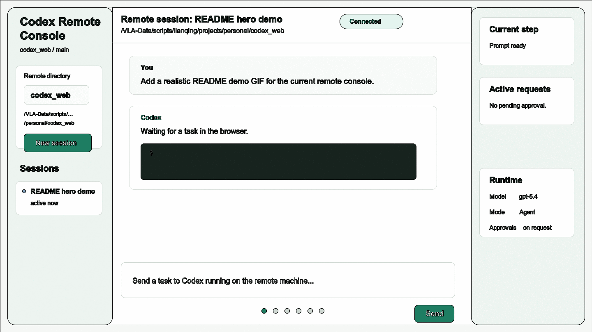
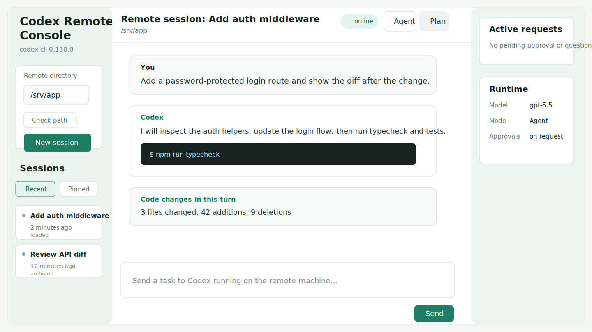
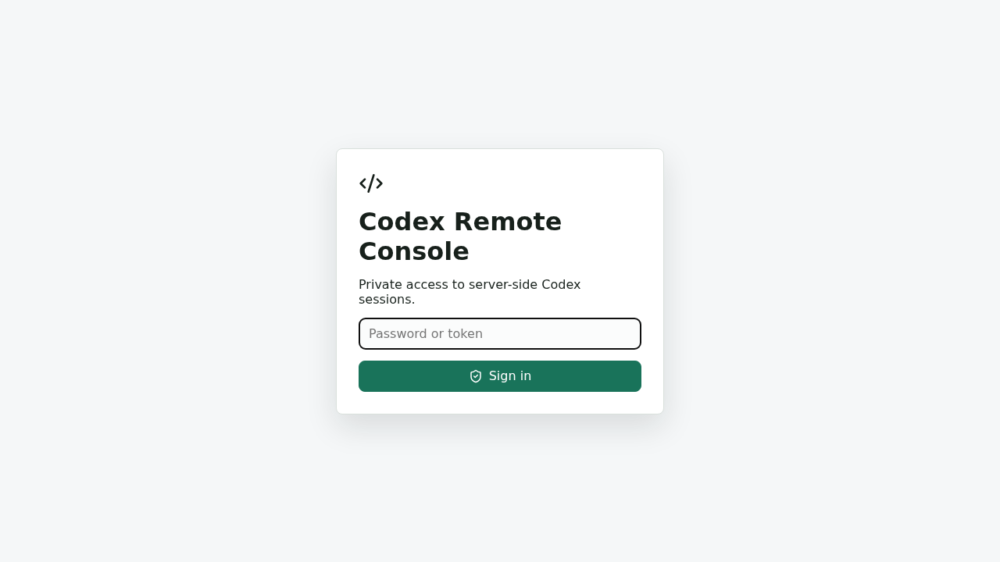
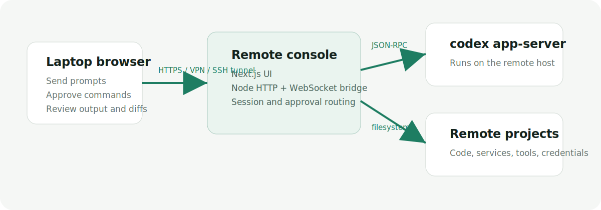
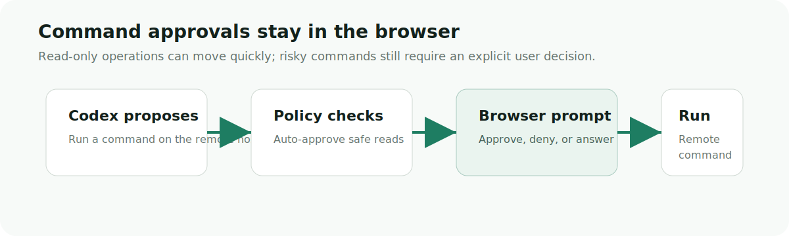

# Codex Remote Console

[](https://nodejs.org/)
[](https://nextjs.org/)
[](LICENSE)

> Run Codex where your repo, tools, GPUs, and secrets already live. Control the session from any trusted browser.

Codex Remote Console is a self-hosted web control panel for Codex CLI sessions running on a remote server, workstation, or lab machine. The Codex CLI, project files, credentials, services, shell access, and network access stay on that remote machine; your browser becomes the console for prompts, approvals, runtime settings, output, and diffs.



Current flow demo: prompt from the browser, remote Codex work, browser approval, streamed command output, then a per-turn diff card.

## Why This Exists

SSH plus tmux is excellent for terminal work, but long Codex sessions have more state than a terminal: approvals, user-input prompts, runtime settings, session history, and reviewable code diffs.

ttyd exposes a shell in the browser, and code-server exposes a full IDE. Codex Remote Console is narrower: a browser control plane for Codex sessions that should keep executing on the machine where the code and environment already are.

Use it when execution must remain server-side, but the control surface should be easier to use from a laptop, iPad, phone, or locked-down work machine than a persistent SSH terminal.

## Status

Alpha. It is suitable for personal and lab-style private deployments behind a trusted network, VPN, SSH tunnel, or reverse proxy with authentication. It is not designed as a public multi-tenant hosted service, and breaking changes are still possible.

Current roadmap:

- Browser-recorded demo GIF to replace the generated current-flow demo.
- Harder deployment docs for HTTPS, process managers, and reverse proxies.
- Better session search, filtering, and archival workflows.
- More explicit audit logs for approvals and auto-approvals.
- Production hardening before any internet-facing deployment guidance.

## Security Model

Codex runs on the remote machine as the same OS user that starts the Node process. Anyone who can access this UI can potentially access that user's projects, shell permissions, network access, and Codex credentials.

Before exposing it beyond your own machine:

- Set `CODEX_WEB_PASSWORD` or `CODEX_WEB_TOKEN`.
- Use a strong `CODEX_WEB_SECRET` so session cookies are not tied to a login credential.
- Put the app behind HTTPS, a trusted private network, VPN, SSH tunnel, or equivalent access control.
- Do not publish `.env`, shell history, logs, screenshots, or README examples containing real passwords, tokens, private hostnames, private usernames, or sensitive project paths.

Production mode refuses to start unless `CODEX_WEB_PASSWORD` or `CODEX_WEB_TOKEN` is set.

## Quick Start

From this repository checkout, run:

```bash
npm install
CODEX_WEB_PASSWORD='change-me' PORT=3027 npm run dev
```

Open:

```text
http://<remote-host>:3027
```

If you are testing on the same machine, use `http://localhost:3027`. The server binds to `0.0.0.0` by default so LAN access and reverse proxies can reach it.

Requirements:

- Node.js `18.18+` and npm.
- The `codex` CLI installed on the remote machine and available on the server `PATH`.
- Codex authenticated for the same remote OS user that starts this server.
- Filesystem access on the remote machine to the project directories you want Codex to edit.

## Typical Setup

Lab GPU machine: run Codex Remote Console on the GPU box where the repo, Conda environment, datasets, CUDA stack, and private network are already configured. Connect from an iPad or company laptop to prompt Codex, approve commands, and inspect diffs without moving the workload.

Home workstation: leave the workstation running the Codex CLI and local services. When away from the desk, connect through a VPN or SSH tunnel from a phone or laptop to approve a command, answer a prompt, or check the latest diff.

Private reverse proxy: serve the app under a path such as `/codex_web/` behind your existing auth, TLS, and network controls, while the Node process continues to run as the remote development user.

## Features

- Start, resume, close, interrupt, and archive remote Codex threads.
- Pick remote project directories from server-side suggestions, recent selections, trusted Codex projects, or manual absolute paths.
- Browse child directories without exposing arbitrary local file contents.
- Stream Codex messages, reasoning summaries, command output, plans, and file changes over WebSocket.
- Keep Codex sessions alive when the browser disconnects.
- Switch runtime settings from the UI, including model, reasoning effort, sandbox mode, approval policy, collaboration mode, and service tier.
- Handle command approvals and `request_user_input` prompts in the browser.
- Auto-approve clearly read-only command approvals while preserving manual checkpoints for destructive commands.
- Record a git snapshot before each Codex turn and show the resulting code diff inline after the turn.
- Use slash commands such as `/diff`, `/review`, `/model`, `/permissions`, `/plan`, `/mcp`, `/plugins`, `/skills`, `/status`, and `/logout`.
- Serve under a configurable base path for reverse proxy deployments.

## Screenshots



| Private login | Remote control flow | Browser approvals |
| --- | --- | --- |
|  |  |  |

## How It Works


The custom server in `server/index.ts` runs on the remote machine. It prepares the Next.js app, serves API routes, and accepts browser WebSocket connections at `/ws`.

On first authenticated use, `server/codex/stdioGateway.ts` starts:

```bash
codex app-server --listen stdio://
```

The browser sends Codex protocol requests to the remote console server, and the server forwards them to the Codex app-server process running on the same remote machine. Codex notifications stream back to connected browsers. Set `CODEX_WEB_GATEWAY=ws` to use the older loopback WebSocket transport.

Thread starts and resumes are adjusted with persistent history defaults:

- `ephemeral: false`
- `experimentalRawEvents: false`
- `persistExtendedHistory: true`

For local browser routes, see [docs/API.md](docs/API.md).

## Authentication

Development mode can run without auth, but private deployments should enable it explicitly:

```bash
CODEX_WEB_PASSWORD='change-me' PORT=3027 npm run dev
```

Token-based login is also supported:

```bash
CODEX_WEB_TOKEN='change-me' PORT=3027 npm run dev
```

For production:

```bash
npm run build
CODEX_WEB_PASSWORD='change-me' CODEX_WEB_SECRET='replace-with-random-secret' PORT=3027 npm run start
```

The login flow creates an HTTP-only session cookie signed with `CODEX_WEB_SECRET`. If `CODEX_WEB_SECRET` is unset, the server falls back to the configured password, token, or `dev-secret`.

## Reverse Proxy

For a subpath deployment at `/codex_web/`, build and run with the same base path:

```bash
NEXT_PUBLIC_BASE_PATH=/codex_web npm run build
NODE_ENV=production NEXT_PUBLIC_BASE_PATH=/codex_web CODEX_WEB_PASSWORD='change-me' PORT=3027 npm run start
```

The bundled scripts provide the same default base path and port.

Development proxy mode:

```bash
CODEX_WEB_PASSWORD='change-me' npm run dev:proxy
```

Production proxy mode:

```bash
CODEX_WEB_PASSWORD='change-me' CODEX_WEB_SECRET='replace-with-random-secret' npm run start:proxy
```

Map your reverse proxy route to the backend server:

```text
https://your-host.example/codex_web/ -> http://127.0.0.1:3027
```

If you use a different proxy path, set `NEXT_PUBLIC_BASE_PATH` to that exact path at build time and runtime.

## Configuration

| Variable | Purpose | Default |
| --- | --- | --- |
| `PORT` | HTTP server port. | `3000` |
| `CODEX_WEB_PORT` | Fallback HTTP server port when `PORT` is not set. | unset |
| `HOST` | HTTP bind host. | `0.0.0.0` |
| `NEXT_PUBLIC_BASE_PATH` | Base path for proxy deployments, for example `/codex_web`. | unset |
| `CODEX_WEB_PASSWORD` | Enables password login and satisfies production auth. | unset |
| `CODEX_WEB_TOKEN` | Enables token login and satisfies production auth. | unset |
| `CODEX_WEB_AUTH` | Set to `on` to require auth in development even without a password or token. | unset |
| `CODEX_WEB_SECRET` | Secret used to sign session cookies. | password, token, or `dev-secret` |
| `CODEX_WEB_GATEWAY` | Codex app-server transport: `stdio` or `ws`. | `stdio` |
| `CODEX_WEB_PROJECT_ROOTS` | Extra project roots for the directory picker, separated with the OS path delimiter. | unset |
| `CODEX_WEB_AUTO_APPROVE` | Set to `off` to disable the server-side auto-approval policy. | enabled |
| `CODEX_WEB_AUTO_APPROVE_READONLY` | Auto-approve command approvals that are read-only list/read/search operations. | enabled |
| `CODEX_WEB_AUTO_APPROVE_MCP` | Auto-approve MCP server elicitation requests. | enabled |
| `CODEX_WEB_APPROVAL_LOG` | Log auto-approved requests in the server console. | enabled |

See `.env.example` for a copyable list of common settings.

## Approval Policy

Codex decides when a command or file change needs approval. Codex Remote Console adds a small server-side policy before those approval requests reach the browser:

- Clearly read-only command approvals are answered automatically. This includes list/read/search actions and common commands such as `ls`, `rg`, `grep`, `cat`, `sed -n`, `git status`, `git diff`, `git log`, and `git show`.
- MCP server elicitation approvals are accepted automatically by default. Set `CODEX_WEB_AUTO_APPROVE_MCP=off` if you want those prompts to reach the browser.
- `request_user_input` prompts still show in the browser because they require a user answer.
- Commands containing `rm` are never auto-approved.
- Destructive git commands such as `git checkout`, `git reset`, `git clean`, `git restore`, and `git switch` are never auto-approved.
- Commands with permission escalation, network policy requests, shell write redirection, or unknown behavior still show the approval dialog.
- File-change and non-dangerous command approvals still show the approval dialog, but the UI includes `Approve session` for approvals that should apply to the rest of the Codex session.
- `Approve session` is hidden for `rm` and destructive git commands so those operations always require a per-request decision.

This keeps read-heavy Codex runs moving while preserving a manual checkpoint for risky operations.

## npm Scripts

| Script | Description |
| --- | --- |
| `npm run dev` | Start the custom Next.js and WebSocket server with `tsx`. |
| `npm run dev:proxy` | Start development mode under `/codex_web` on port `3027`. |
| `npm run build` | Build the Next.js app. |
| `npm run build:proxy` | Build with `NEXT_PUBLIC_BASE_PATH=/codex_web`. |
| `npm run start` | Start the production server. Requires auth configuration. |
| `npm run start:proxy` | Build and start production mode under `/codex_web` on port `3027`. |
| `npm run test:slash` | Test the slash command registry. |
| `npm run test:diff` | Test server-side git diff collection. |
| `npm run typecheck` | Run TypeScript without emitting files. |
| `npm run check` | Run typecheck and a normal production build. |
| `npm run check:proxy` | Run typecheck and a proxy-path production build. |
| `npm run generate:codex-protocol` | Regenerate Codex protocol TypeScript from `codex app-server`. |

## Project Layout

```text
app/
  globals.css       Global styles for the web UI.
  layout.tsx        Next.js root layout and metadata.
  page.tsx          Main browser client for sessions, prompts, slash commands, and project picker.
  sessionRuntime.ts Runtime setting helpers for Codex session configuration.
  slashCommands.ts  Slash command registry and matching helpers.

server/
  approvalPolicy.ts Approval policy for read-only Codex command requests.
  auth.ts           Password/token login and signed session cookies.
  codex/            Lifecycle and stdio/ws JSON-RPC transports for `codex app-server`.
  codexGateway.ts   Compatibility export for the Codex gateway factory.
  gitDiff.ts        Working-tree snapshot, file preview, and diff collection.
  http.ts           JSON response/request helpers.
  index.ts          Custom HTTP, Next.js, API, and WebSocket server.
  project.ts        Project path resolution, directory browsing, and suggestions.
  types.ts          Shared server protocol types.

docs/
  API.md            Browser-local HTTP and WebSocket route reference.
  images/           README screenshots and diagrams.

scripts/
  gitDiff.test.ts        Git diff helper tests.
  slashCommands.test.ts  Slash command registry tests.
  kill-codex-remote-console.sh      Helper for stopping a local dev/proxy server.
```

## Repository Metadata

Suggested GitHub About text:

```text
Self-hosted browser console for controlling Codex CLI sessions on a remote machine.
```

Suggested GitHub topics:

```text
codex, codex-cli, remote-development, webui, ai-coding, self-hosted, nextjs, websocket
```

## Development

Run focused tests:

```bash
npm run test:slash
npm run test:diff
```

Run standard checks:

```bash
npm run typecheck
npm run build
npm audit --omit=dev
```

For the `/codex_web/` proxy deployment path:

```bash
npm run check:proxy
```

## Troubleshooting

`codexVersion` shows `unavailable`

The `codex` executable is not available on the server `PATH` used by the Node process.

`Set CODEX_WEB_PASSWORD or CODEX_WEB_TOKEN before running in production`

Production mode refuses to start without auth. Set one of those variables before `npm run start`.

`Timed out waiting for codex app-server`

The spawned `codex app-server` did not become ready within the startup timeout. Check the server logs for `[codex-app-server]` output and verify the Codex CLI works from the same shell.

Assets or WebSocket requests fail behind a proxy

Confirm that `NEXT_PUBLIC_BASE_PATH` matches the proxy path at both build time and runtime.

The UI opens but project actions fail

Verify that the Node process user can read and write the selected project directory, and that the path is absolute.

## Contributing

Issues and pull requests are welcome. Keep changes small, include focused tests for behavior changes, and avoid adding dependencies unless the project genuinely needs them.

## License

MIT. See [LICENSE](LICENSE).
