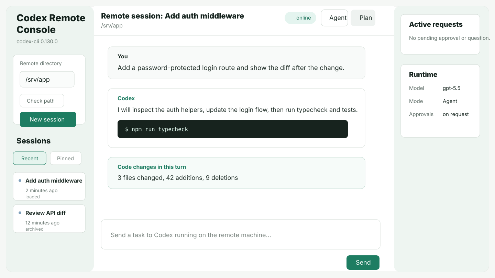
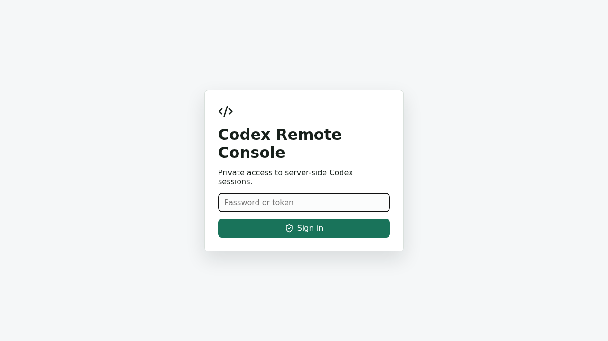
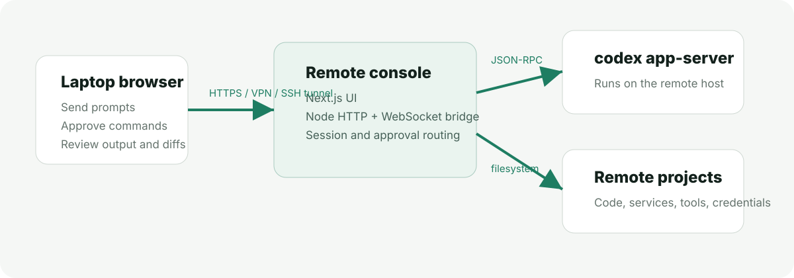
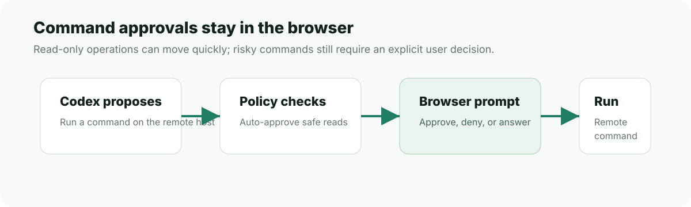

# Coding Agent Console

[](https://nodejs.org/)
[](https://nextjs.org/)
[](LICENSE)

_Self-hosted web UI for Codex, Cursor Agent, and Claude Code on the machine where your repo and environment already live._

Coding agents stay on the server (GPU box, workstation, lab). The browser provides one console for provider-scoped sessions, streaming output, safe runtime controls, and diffs. Codex uses `codex app-server`; Cursor uses the locally authenticated `cursor-agent` CLI; Claude uses the official `claude` CLI (`thread`/`turn`, `--session-id` / `--resume`).



*The existing Codex workflow remains available; Cursor and Claude sessions use the same workspace console with provider-specific controls.*

## Features

- Choose Codex, Cursor Agent, or Claude Code per session. Switching providers creates a new empty session in the same workspace and never migrates context.
- Cursor CLI execution modes are native-session scoped. Switching a Cursor session between Agent, Plan, and Ask creates and selects a new empty Cursor session in the same workspace so the CLI cannot silently remain in the previous read-only mode.
- Start, resume, rename, archive, and manage provider-scoped sessions; runs continue when the tab closes.
- Project picker (suggestions + safe directory browsing—no arbitrary file dumps).
- WebSocket streaming of normalized messages, tools, run state, and provider diagnostics.
- Durable per-session server queue: accepted text prompts are committed to local SQLite, continue after the browser closes, and pause safely on failure, Stop, approval, or uncertain restart recovery. A compact composer queue shows running, waiting, paused, failed, and needs-review work with Resume, Retry, and Remove actions; session rows surface queued and paused state without turning the console into a dashboard.
- Project Files workspace with lazy directory browsing, direct server-directory uploads, GFM Markdown preview/source, and line-numbered Python/code viewing.
- Codex keeps model, reasoning, sandbox, approval, service-tier, and collaboration controls.
- The header shows the live standard Codex account bucket (used percentage and UTC reset time) when the current Codex login exposes rate-limit data.
- Cursor sessions show the same header usage pill from the signed-in `cursor-agent` account: remaining included spend and the billing-cycle reset time, refreshed after each turn and every 45 seconds.
- Cursor provides model plus native Agent, Plan, and Ask modes. Agent mode is visibly identified as sandboxed auto-run; Plan and Ask remain read-only.
- Claude Code uses the same thread/turn console API as Codex, with Plan mode (`--permission-mode plan`) and Agent mode (`acceptEdits`) on the same session. Ask mode and browser approvals are not exposed in this first cut.
- Codex browser approvals and `request_user_input` continue to work; unsupported controls are hidden for Cursor and Claude instead of simulated.
- Non-blocking, best-effort Git snapshots each turn + inline and workspace diff; slash commands (`/diff`, `/review`, `/model`, `/permissions`, and others).
- Optional Feishu turn-completion notify: one private group per Codex, Cursor Agent, or Claude Code session via `lark-cli`, with the full final answer split across ordered markdown messages when needed.
- Configurable base path for reverse proxies.

## Requirements

Node **18.18+** and at least one available provider for the same OS user that runs this app:

- `codex` on `PATH`, authenticated for Codex sessions.
- `cursor-agent` on `PATH`, logged in for Cursor sessions.
- `claude` on `PATH`, authenticated with `claude auth login` for Claude sessions.

Provider health is independent. A missing or logged-out Cursor or Claude CLI does not prevent Codex from starting, and a Codex startup failure does not disable the other providers.

## Quick start

```bash
npm install
CODEX_WEB_PASSWORD='change-me' PORT=3032 npm run dev
```

Open `http://<host>:3032` (defaults bind `0.0.0.0` for LAN / proxy).

**Production:**

```bash
npm run build
CODEX_WEB_PASSWORD='change-me' CODEX_WEB_SECRET='use-a-long-random-secret' PORT=3032 npm run start
```

`CODEX_WEB_TOKEN` works instead of password. Production refuses to start without password or token.

## Security

**Alpha.** For private VPN / SSH tunnel / trusted LAN or reverse proxy with your own auth and TLS—not a multi-tenant public service.

Whoever reaches the UI runs as the same user as the Node process (projects, shell, Codex and Cursor credentials). Set `CODEX_WEB_PASSWORD` or `CODEX_WEB_TOKEN`, use a strong `CODEX_WEB_SECRET` for cookie signing, and never commit real secrets. Cursor Agent mode passes `--sandbox disabled --trust` and intentionally omits `--force` for compatibility with the current host kernel. This is not a filesystem boundary: Cursor tools may read or modify paths outside the selected workspace with the Node service user's permissions. Use Cursor Agent mode only on a private deployment where that access is explicitly accepted; Ask and Plan remain read-only alternatives.

## Screenshots

| Login | Flow | Approvals |
| --- | --- | --- |
|  |  |  |

## How it works (short)

The custom server (`server/index.ts`) serves Next.js + WebSockets at `/ws` and exposes provider-qualified browser requests. The Codex adapter wraps `codex app-server --listen stdio://` (`server/codex/stdioGateway.ts`) without rewriting its thread, turn, approval, or notification semantics. The Cursor adapter creates Web-owned native chats, launches `cursor-agent --output-format stream-json`, and persists only the normalized UI transcript and console-owned metadata. Native Cursor context continues through `--resume`; prior text is not reinjected. Claude speaks the same `thread/*` and `turn/*` methods as Codex, spawning `claude -p --output-format stream-json` with `--session-id` on the first turn and `--resume` after that, and reading transcripts from `~/.claude/projects`.

HTTP/WebSocket routes: [docs/API.md](docs/API.md).

## Behind a reverse proxy (subpath)

Build and run with the same base path, e.g. `/codex_web_cursor/`:

```bash
NEXT_PUBLIC_BASE_PATH=/codex_web_cursor npm run build
NODE_ENV=production NEXT_PUBLIC_BASE_PATH=/codex_web_cursor CODEX_WEB_PASSWORD='change-me' PORT=3032 npm run start
```

Or use **`npm run dev:proxy`** / **`npm run start:proxy`** for the bundled defaults. Proxy: `https://your-host.example/codex_web_cursor/` → `http://127.0.0.1:3032`.

## Configuration & scripts

**Env:** see [`.env.example`](.env.example) for variables (`PORT`, `HOST`, `NEXT_PUBLIC_BASE_PATH`, auth, cookie secret, gateway, auto-approve flags, optional `CODEX_WEB_PROJECT_ROOTS`, `CODEX_WEB_PROXY_URL`, `CODING_AGENT_CONSOLE_STATE_DIR`, Feishu notify flags, etc.). `CODEX_WEB_PROXY_URL` fills missing HTTP/HTTPS/WebSocket proxy variables for spawned Codex, Cursor, and Claude processes without overriding variables already supplied by the process manager.

**Agent attachments:** **Attach to agent** in the Composer accepts up to eight files per turn through the picker, paste, or drag-and-drop. Files are streamed to the server first and stored with private permissions under `CODING_AGENT_CONSOLE_STATE_DIR/uploads` (default `~/.local/share/coding-agent-console/uploads`). Image files remain native visual inputs; other files are passed to Codex/Cursor/Claude as server-side file references. Removing an unsent attachment also removes its server copy.

**Project uploads:** open **Files**, browse to the destination directory, and choose **Upload here**. These files are written into the selected project directory and remain there independently of a chat turn. Existing files require an explicit replacement confirmation. Both upload paths use the `CODEX_WEB_UPLOAD_MAX_BYTES` per-file limit, which defaults to 50 MiB and is capped at 100 MiB.

**Feishu notify:** set `CODEX_WEB_FEISHU_NOTIFY=on` in `.env.local` and ensure `lark-cli` bot login works. The custom server loads `.env.local` before it snapshots runtime configuration. On each terminal Codex, Cursor Agent, or Claude Code turn, it creates/reuses a provider-specific private group (`Codex · {session}`, `Cursor Agent · {session}`, or `Claude Code · {session}`) and sends the complete final answer. Codex Plan `request_user_input` questions are sent to the same private group with their choices as a one-way notice; the configured user returns to the web Console to submit the answer. Other approval requests do not trigger this notice. Long answers and question sets are split into numbered markdown messages at natural text boundaries; deterministic idempotency keys prevent already-delivered parts from duplicating after a retry. `CODEX_WEB_FEISHU_CHUNK_MAX_BYTES` controls the per-part body size. Failed and cancelled Cursor runs are terminal notifications too.

**npm:** `npm run dev` · `npm run build` · `npm run start` · `npm run check` / `npm run check:proxy` · `npm run test:all` · `npm run test:uploads` · `npm run test:server-env` · `npm run test:feishu` · `npm run test:cursor-feishu` · `npm run test:warm-pool` · `npm run test:cursor` · `npm run test:claude` · `npm run test:provider-ui` · `npm run test:provider-protocol` · `npm run test:auth-isolation` · `npm run generate:codex-protocol`.

Approval behavior (read-only auto-approve, MCP, destructive commands) is summarized in `.env.example` and implemented in `server/approvalPolicy.ts`.

## Troubleshooting

| Symptom | Likely fix |
| --- | --- |
| `codexVersion` unavailable | `codex` not on PATH for the Node process. |
| Cursor provider disabled | Confirm `cursor-agent --version` and `cursor-agent --list-models` work for the Node service user. |
| Claude provider disabled | Confirm `claude --version` and `claude auth status` work for the Node service user. |
| Production auth error | Set `CODEX_WEB_PASSWORD` or `CODEX_WEB_TOKEN`. |
| `Timed out waiting for codex app-server` | Confirm `codex app-server` works from the same environment; check logs for `[codex-app-server]`. |
| Turn stays active with an OpenAI connection error | Set `CODEX_WEB_PROXY_URL` (or standard proxy variables) in the server environment, then restart the service. |
| Broken assets/WebSocket behind proxy | `NEXT_PUBLIC_BASE_PATH` must match the proxy path at **build** and **run** time. |
| Cursor transcript missing after restart | Check permissions and free space under `CODING_AGENT_CONSOLE_STATE_DIR` or `~/.local/share/coding-agent-console`. |

## Contributing & license

Issues and PRs welcome—small changes, tests where behavior shifts, avoid dependency bloat.

**License:** MIT — [LICENSE](LICENSE).

**GitHub About (suggested):** Self-hosted browser console for Codex and Cursor Agent on a remote machine.
**Topics:** `codex`, `codex-cli`, `cursor-agent`, `remote-development`, `webui`, `ai-coding`, `self-hosted`, `nextjs`, `websocket`.
