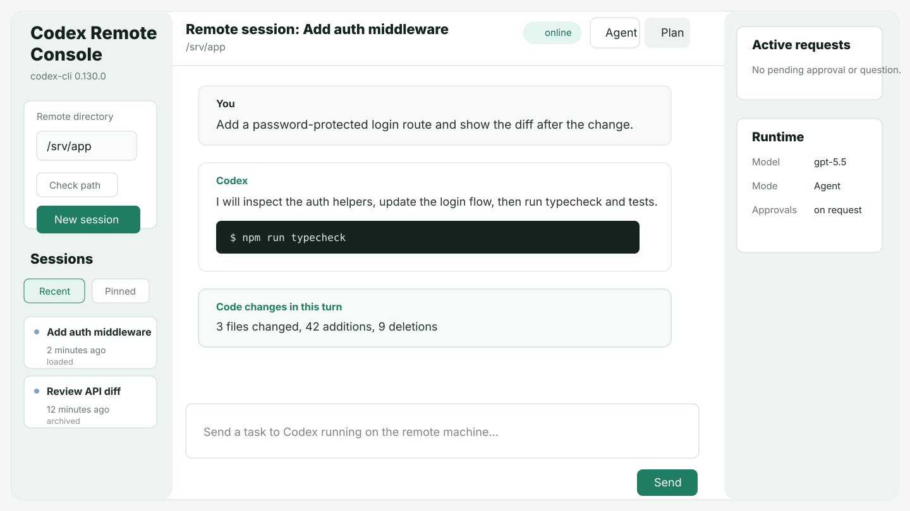

# Coding Agent Console

[](https://nodejs.org/)
[](https://nextjs.org/)
[](LICENSE)

**A self-hosted browser workspace for Codex, Cursor Agent, and Claude Code.**

English · [简体中文](README.zh-CN.md)

Keep your repositories, coding agents, and development environment on your workstation or remote server. Use a browser to send tasks, follow live output, answer Codex approvals, browse files, and review changes—from a desktop or phone. Accepted queued tasks continue when you close the tab, as long as the server and agent processes keep running.



[Quick start](#quick-start) · [Features](#features) · [Provider support](#provider-support) · [Deployment](#deployment) · [Configuration](#configuration) · [Troubleshooting](#troubleshooting)

## Features

| What you want to do | What the console provides |
| --- | --- |
| Work with different agents | Codex, Cursor Agent, and Claude Code with separate sessions and provider-specific controls. |
| Keep work moving | A durable SQLite queue per session, with running/waiting/paused states and Resume, Retry, and Remove actions. |
| Follow long tasks | Streaming Markdown, tool activity, collapsible turns titled with your prompt, and request timing when available. |
| Return to a conversation | Recent sessions, browser Back/Forward navigation, session links, tab-local text draft recovery, and history loaded in batches. |
| Inspect the workspace | Directory browsing, Markdown preview/source, line-numbered code, project uploads, and inline/workspace Git diffs. |
| Supply context | Up to eight attachments per turn through the picker, paste, or drag-and-drop; images remain visual inputs. |
| Make the UI comfortable | Light, Dark, and System themes; Green, Blue, Purple, and Amber accents; Minimal and Detailed phone layouts. |
| Track usage | Codex account usage and Cursor included-spend indicators when the signed-in provider exposes them. |
| Get optional notifications | Feishu/Lark session groups with final answers and Codex Plan input-request notices. |

### Recent improvements

- **More responsive conversations:** immediate first text, bounded streaming updates, independent provider-list loading, and fewer redundant history and queue refreshes.
- **Better session recovery:** bounded Codex history reads, corrected Recent ordering, connection heartbeat/reconnect handling, and drafts scoped to each provider/session.
- **Clearer task inspection:** improved Claude tool rendering, user-prompt titles on expanded turns, more room for conversation content, and corrected usage-pill sizing.
- **Long-session controls:** Codex resident-thread reuse when settings match, configurable automatic compaction, manual compaction, and an editable handoff for a fresh conversation.
- **Mobile and appearance updates:** persistent theme preferences, Sessions/Chat/Tools navigation, and keyboard-aware phone layout. Native iPhone keyboard behavior still requires real-device verification.

The Files workspace currently provides browsing, previews, uploads, and diffs. An embedded VS Code/code-server editor is not included.

## Provider support

Install and authenticate the providers you want to use **as the same OS user that runs the console**. Each provider reports its own health; one unavailable CLI does not disable the others.

| Capability | Codex | Cursor Agent | Claude Code |
| --- | --- | --- | --- |
| Local executable | `codex` | `cursor-agent` | `claude` |
| Backend | `codex app-server` | Native CLI chats and stream JSON | CLI session IDs/resume and stream JSON |
| Execution modes | Agent / Plan | Agent / Plan / Ask | Agent / Plan |
| Runtime controls | Model, reasoning, sandbox, approvals, service tier | Model and execution mode | Provider-specific model/mode controls |
| Browser approval/input UI | Supported | Not exposed | Not exposed |
| Switching modes | Session runtime settings | Creates a new empty Cursor session | Keeps the same session |

Switching **providers** always creates a new empty session in the same workspace. Context is not transferred between providers.

Cursor Agent runs with `--sandbox disabled --trust`; it has the Node service user's filesystem access. Cursor Plan and Ask are read-only modes. Claude Agent uses `acceptEdits`, and Claude Plan uses `plan`. Unsupported controls are hidden.

## Quick start

Use **Node.js 24** (verified with 24.12.0), npm, Git, and at least one authenticated provider CLI. The server uses built-in `node:sqlite` and `process.loadEnvFile`; Node 18 is not supported by this implementation.

```bash
git clone https://github.com/lianqing11/codex-remote-console.git
cd codex-remote-console
npm ci
cp .env.example .env.local
```

Edit `.env.local` before starting:

```dotenv
HOST=127.0.0.1
PORT=3032
CODEX_WEB_PASSWORD=replace-with-a-strong-password
CODEX_WEB_SECRET=replace-with-a-long-random-secret
```

Then run:

```bash
npm run dev
```

Open **http://127.0.0.1:3032**, sign in, select a project directory and provider, and send your first task. For a remote server, use a private tunnel or the reverse-proxy setup below. The server loads `.env.local` automatically; existing process environment variables take precedence.

> This is an alpha tool for a trusted private deployment. Agent commands run with the Node service user's permissions. Use authentication and TLS or a private tunnel, and keep credentials out of Git. Project-root restrictions apply to file APIs; they are not an agent sandbox or a multi-tenant security boundary.

## Deployment

### Production

With authentication already configured in `.env.local`:

```bash
npm run build
npm run start
```

Production requires `CODEX_WEB_PASSWORD` or `CODEX_WEB_TOKEN`. Use a separate random `CODEX_WEB_SECRET` for signed cookies. Set `CODEX_WEB_COOKIE_SECURE=on` when serving over HTTPS.

### Reverse proxy and subpaths

Use the same base path at build time and runtime:

```bash
NEXT_PUBLIC_BASE_PATH=/codex_web_cursor npm run build
NEXT_PUBLIC_BASE_PATH=/codex_web_cursor npm run start
```

Configure your proxy to expose `https://your-host.example/codex_web_cursor/` and forward to the loopback listener, preserving WebSocket upgrades and stripping the `/codex_web_cursor` prefix from upstream requests. The custom HTTP/WebSocket server accepts paths at its root; the Next.js assets use the configured base path.

The bundled `dev:proxy`, `build:proxy`, and `start:proxy` scripts use `/codex_web_cursor` and port 3032. `start:proxy` rebuilds first. Wait until active work and queues are idle before restarting an existing service.

## Configuration

See [`.env.example`](.env.example) for the full configuration template. Keep actual secrets, paths, and proxy endpoints in `.env.local` or the process manager environment.

| Variable | Purpose |
| --- | --- |
| `HOST`, `PORT` | Listener address/port. Set explicitly; code defaults are `0.0.0.0:3000`, while the example uses port 3032. |
| `CODEX_WEB_PASSWORD` / `CODEX_WEB_TOKEN` | Console login credentials. |
| `CODEX_WEB_SECRET` | Cookie-signing secret. |
| `NEXT_PUBLIC_BASE_PATH` | Reverse-proxy subpath, identical at build and runtime. |
| `CODEX_WEB_PROJECT_ROOTS` | Restrict project resolve/list/read APIs to configured roots. |
| `CODING_AGENT_CONSOLE_STATE_DIR` | Console-owned state; defaults to `~/.local/share/coding-agent-console`. |
| `CODEX_WEB_UPLOAD_MAX_BYTES` | Per-file upload limit; default 50 MiB, maximum 100 MiB. |
| `CODEX_WEB_AUTO_COMPACT_TOKEN_LIMIT` | Managed Codex stdio compaction threshold; default `200000`, integer ≥ `10000`, or `inherit`. |
| `CODEX_WEB_PROXY_URL` | Upstream for the local selective proxy used by spawned agents; official OpenAI/Cursor/Anthropic hosts use it, other traffic goes direct. |
| `CODEX_WEB_FEISHU_NOTIFY` | Set to `on` to enable optional Feishu notifications. |

### Files and attachments

**Attach to agent** uploads temporary context into the private state directory. Removing an unsent attachment removes its server copy. Text drafts survive a tab reload through `sessionStorage`; uploaded attachments are not restored as drafts.

**Files → Upload here** writes directly into the selected project directory. These files remain independently of a conversation. Replacing an existing file requires confirmation.

### Queues and long sessions

Accepted text prompts are saved in SQLite before dispatch. Failure, Stop, approval, or uncertain restart recovery can pause the queue for review. Closing the browser does not cancel server-side work; stopping the server can interrupt it.

Codex reuses a resident thread only when its resume settings match. Changing model, permissions, or other resume settings triggers a real resume. Managed stdio compaction settings apply after an idle service restart; external WebSocket gateways retain their own configuration. Compaction may lose older detail and can take time. A fresh session with an editable handoff is useful for a separate task.

Queue-backed requests retain admission, dispatch, resume, start, first-output/tool, and terminal timing when available. Older and direct runs may lack these fields. Cumulative token usage is shown separately from the last request's input.

### Optional Feishu/Lark notifications

Enable `CODEX_WEB_FEISHU_NOTIFY=on`, configure `CODEX_WEB_FEISHU_USER_OPEN_ID` privately, and authenticate the `lark-cli` bot. Each provider session gets a private group for terminal-turn notifications. Full final answers are split into ordered messages when needed; `CODEX_WEB_FEISHU_CHUNK_MAX_BYTES` controls chunk size.

Codex Plan input requests are also posted with their choices. Submit answers in the web console; the notice is one-way. Other approval requests do not trigger this notice. Failed and cancelled Cursor turns also generate terminal notifications.

## Development and verification

```bash
npm run typecheck
npm run test:all
npm run build
```

`npm run check` combines type checking and a build; `npm run check:proxy` builds for the bundled subpath. Use an isolated build directory (`NEXT_DIST_DIR=.next-review`) when a running service uses the default build output.

Browser checks require Python, Playwright, Chromium, and a running test frontend. For example, `npm run test:playwright-appearance` exercises themes, phone layouts, streaming, reconnects, and expired authentication with mocked provider events. Configure `CODING_AGENT_CONSOLE_TEST_URL` and the normal authentication environment. Reports go to ignored `.codex_web/ui-verification/`. Browser fixtures do not establish live provider or native iPhone behavior.

The custom server is in [`server/index.ts`](server/index.ts), provider adapters in [`server/providers`](server/providers), and the Codex gateway in [`server/codex`](server/codex). See [the API reference](docs/API.md) for HTTP/WebSocket routes and [`package.json`](package.json) for focused test scripts.

## Troubleshooting

| Symptom | What to check |
| --- | --- |
| Missing `node:sqlite` or `loadEnvFile` | Use Node 24 for the service process, not only your interactive shell. |
| A provider is unavailable | Verify its executable and login under the service user; for Claude, check `claude auth status`; for Cursor, check `cursor-agent --list-models`. |
| Production refuses to start | Set `CODEX_WEB_PASSWORD` or `CODEX_WEB_TOKEN`. |
| Codex app-server startup times out | Run `codex app-server` in the same environment and inspect `[codex-app-server]` logs. |
| Agent connection errors | Check the provider's network access and optional proxy configuration; apply environment changes during an idle restart. |
| Broken assets or WebSocket behind a proxy | Match the build/runtime base path, strip the prefix upstream, and forward WebSocket upgrades. |
| Queue is paused after failure or restart | Inspect the item and use Resume/Retry after checking whether the previous action completed. |
| Missing Cursor transcript after restart | Check state-directory permissions, free space, and whether the service user/state path changed. |

## Contributing and license

Issues and focused pull requests are welcome. Include reproduction steps and relevant checks; keep credentials, runtime state, uploads, logs, and build output out of commits.

Released under the [MIT License](LICENSE).
